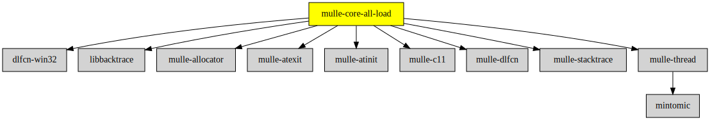

# mulle-core-startup

#### 🛸 mulle-core-startup does something

Force-linkable amalgamated library for mulle-core initialization libraries


| Release Version                                       | Release Notes  | AI Documentation
|-------------------------------------------------------|----------------|---------------
|  [](//github.com/mulle-core/mulle-core-startup/actions) | [RELEASENOTES](RELEASENOTES.md) | [DeepWiki for mulle-core-startup](https://deepwiki.com/mulle-core/mulle-core-startup)


### You are here




## Add

**This project is a component of the [mulle-core](//github.com/mulle-core/mulle-core) library. As such you usually will *not* add or install it
individually, unless you specifically do not want to link against
`mulle-core`.**


### Add as an individual component

Use [mulle-sde](//github.com/mulle-sde) to add mulle-core-startup to your project:

``` sh
mulle-sde add github:mulle-core/mulle-core-startup
```

To only add the sources of mulle-core-startup with dependency
sources use [clib](https://github.com/clibs/clib):


``` sh
clib install --out src/mulle-core mulle-core/mulle-core-startup
```

Add `-isystem src/mulle-core` to your `CFLAGS` and compile all the sources that were downloaded with your project.


## Install

Use [mulle-sde](//github.com/mulle-sde) to build and install mulle-core-startup and all dependencies:

``` sh
mulle-sde install --prefix /usr/local \
   https://github.com/mulle-core/mulle-core-startup/archive/latest.tar.gz
```

### Legacy Installation

Install the requirements:

| Requirements                                 | Description
|----------------------------------------------|-----------------------
| [mulle-core](https://github.com/mulle-core/mulle-core)             | 🌋 Almagamated library of mulle-core + mulle-concurrent + mulle-c

Download the latest [tar](https://github.com/mulle-core/mulle-core-startup/archive/refs/tags/latest.tar.gz) or [zip](https://github.com/mulle-core/mulle-core-startup/archive/refs/tags/latest.zip) archive and unpack it.

Install **mulle-core-startup** into `/usr/local` with [cmake](https://cmake.org):

``` sh
PREFIX_DIR="/usr/local"
cmake -B build                               \
      -DMULLE_SDK_PATH="${PREFIX_DIR}"       \
      -DCMAKE_INSTALL_PREFIX="${PREFIX_DIR}" \
      -DCMAKE_PREFIX_PATH="${PREFIX_DIR}"    \
      -DCMAKE_BUILD_TYPE=Release &&
cmake --build build --config Release &&
cmake --install build --config Release
```


## Author

[Nat!](https://mulle-kybernetik.com/weblog) for Mulle kybernetiK  


